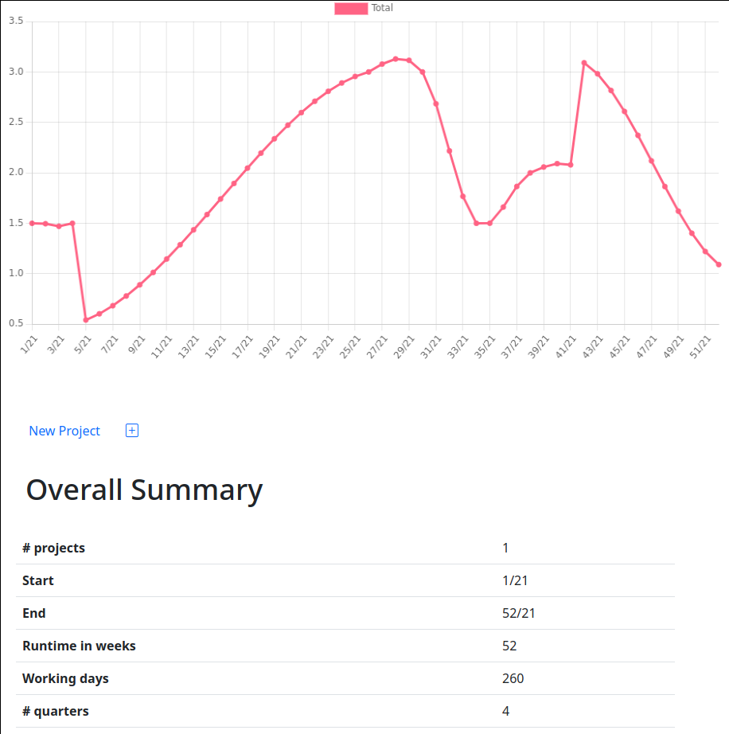

# Resourceer

A modern resource management tool that is easy to learn. It is unbiased towards your organization's and projects' structure, and supports predictive and determined efforts for every stage of your projects.



It is available for Windows and Linux, and offers localizations for the English and German language.

## Installation

### Windows

Check the [downloads](https://github.com/nikolas-beisemann/resourceer/releases) for the Windows installer. Running the installer creates a user local installation for Resourceer. No administrative rights required.

### Linux

Check the [downloads](https://github.com/nikolas-beisemann/resourceer/releases) for the Linux packages. Run the `resourceer` binary within the supplied zip archive.

## Development

### Building the Application

After cloning the [repository](https://github.com/nikolas-beisemann/resourceer) and switching into the cloned directory, run

```
npm i
npm start
```

to build and start up the application.

If you want to change the application's localization, configure this within the `package.json`:

```
  "config": {
    "resourceer": {
      "language": "de"
    },
```

The default localization is German.

### Distributing the Application

Running `npm run make` creates distributable packages within the `out/` directory of the repository.

### Getting Started

Run

```
npx gulp docs
```

and open the created `dev_guide/index.html` in a browser of your choice to familiarize yourself with the architecture.

With

```
npm test
```

you can verify your changes.

Please assure you have read the developer's guide before submitting any pull requests.